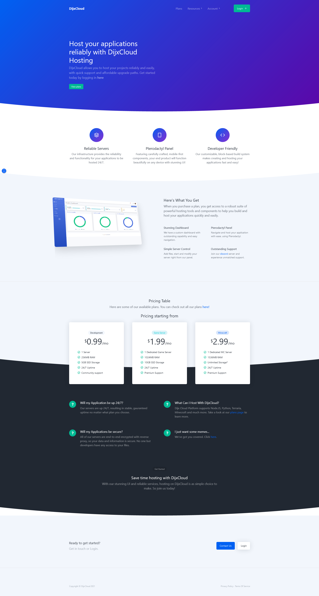
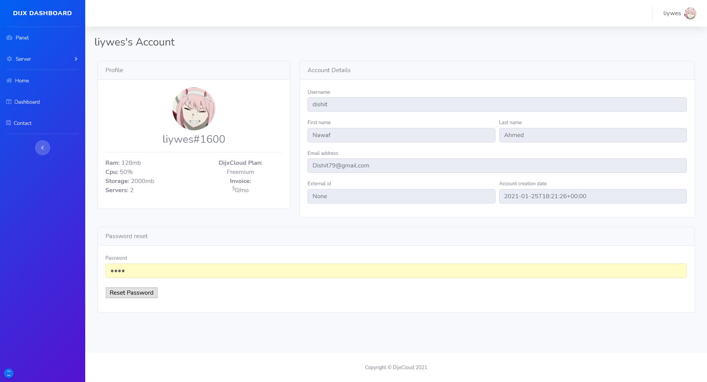
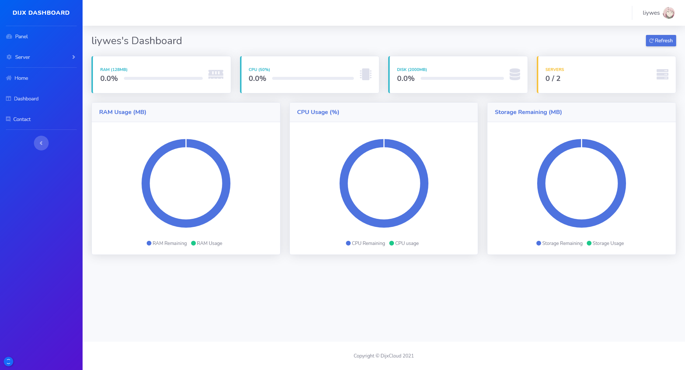
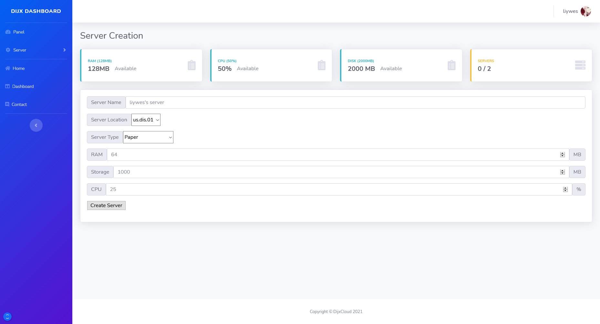

# DisCloud CDN
Flask based website for hosting companies with discord login and Pterodactyl integration. With this user can create their own server with given plans and limited resources. Users will automatically create accounts on Pterodactyl and MongoDB upon first join. 

## Landing page

## Dashboard

## Server Creation

## Profile Page

